###

<table>
<tbody><tr>

<td width="20%" >

</td>
<!--- <td width="640" height="120" vertical-alignvalign="top"> -->
<td width="80%">
<a href="./tvcg21/">Adaptive Irradiance Sampling for Many-Light Rendering of Subsurface Scattering </a> 
K. Nabata, K. Iwasaki  
<b>IEEE Transactions on Visualization and Computer Graphics </b>  
</td>
</tr>

<tr>
<td width="20%">
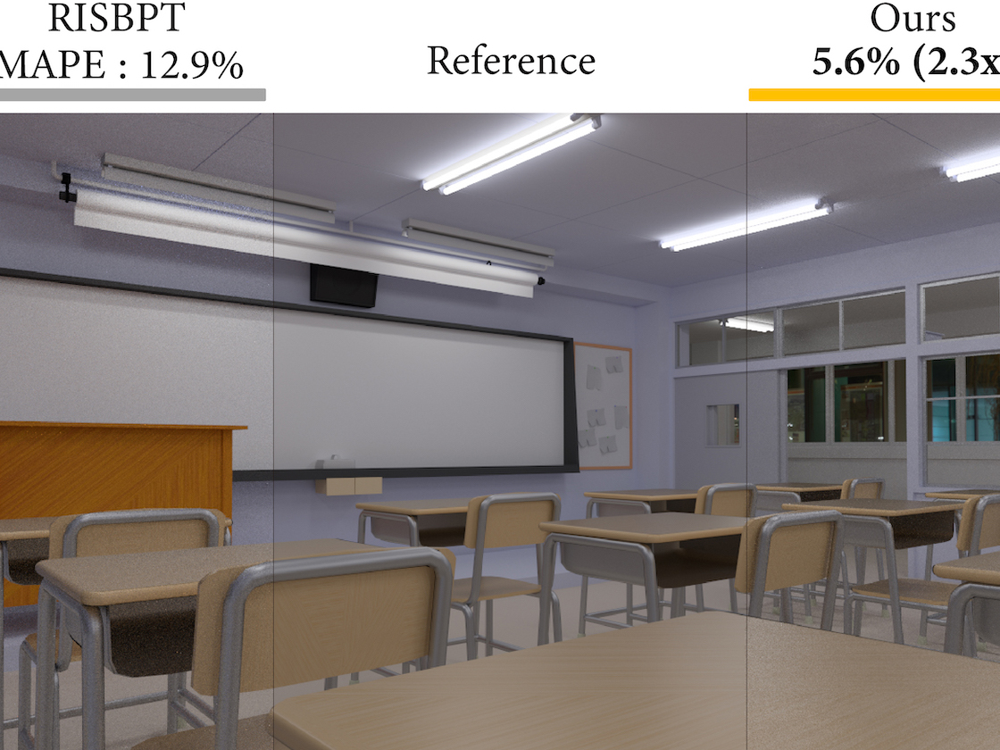
</td>
<td width="80%" height="120">
<a href="https://web.wakayama-u.ac.jp/~iwasaki/project/tsrbpt">
Two-stage Resampling for Bidirectional Path Tracing with Multiple Light Sub-paths</a>
K. Nabata, K. Iwasaki, Y. Dobashi 
<b> Computer Graphics Forum (Pacific Graphics 2020) </b>
</td>
</tr>
<tr>
<td width="20%">
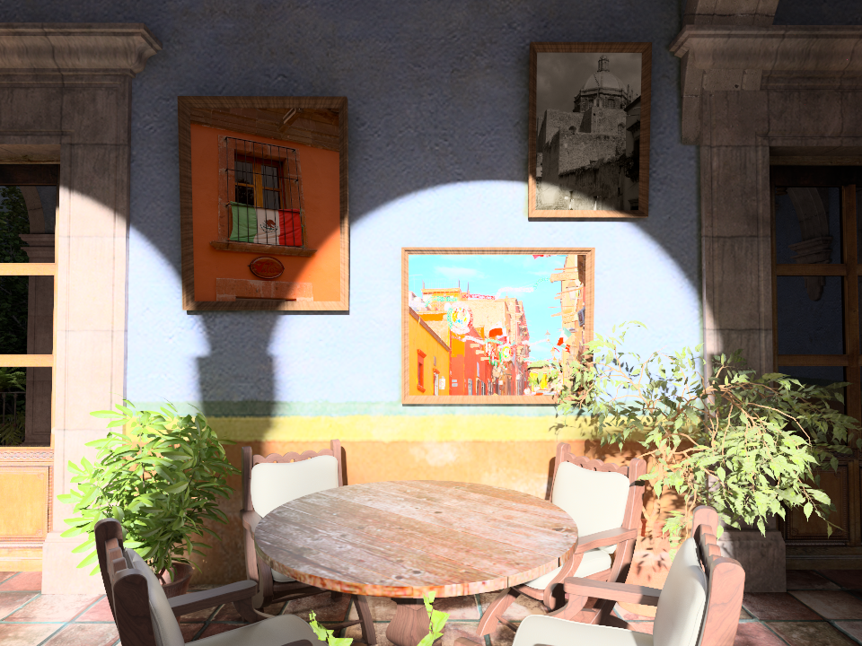
</td>
<td width="80%" height="120">
Resampling-aware Weighting Functions for Bidirectional Path Tracing using Multiple Light Sub-paths 
K. Nabata, K. Iwasaki, Y. Dobashi 
<b> ACM Transactions on Graphics (presented at SIGGRAPH 2020) </b>
</td>
</tr>
<tr>
<td width="20%">
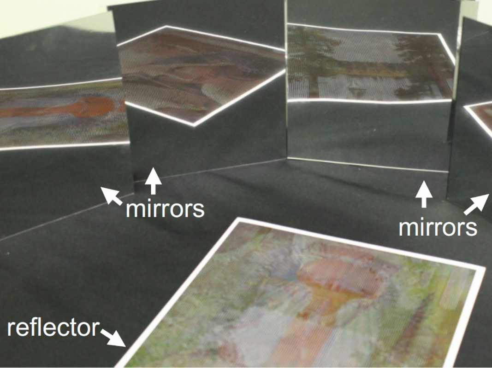
</td>
<td width="80%" height="120">
<a href="http://ksakurai.sakura.ne.jp/SG18/">
Fabricating Reflectors for Displaying Multiple Images</a>  
K. Sakurai, Y. Dobashi, K. Iwasaki, T. Nishita   
<b>ACM Transactions on Graphics (SIGGRAPH2018) </b>
</td>
</tr>
<tr>
<td width="20%">
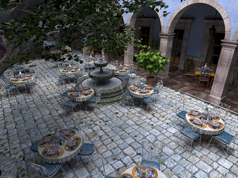
</td>
<td width="80%" height="120">
<a href="https://web.wakayama-u.ac.jp/~iwasaki/project/manylight/">
An Error Estimation Framework for Many-Light Rendering</a>  
K. Nabata, K. Iwasaki, Y. Dobashi, T. Nishita  
<b>Computer Graphics Forum (Pacific Graphics 2016)</b>
</td>
</tr>
<tr>
<td width="20%">
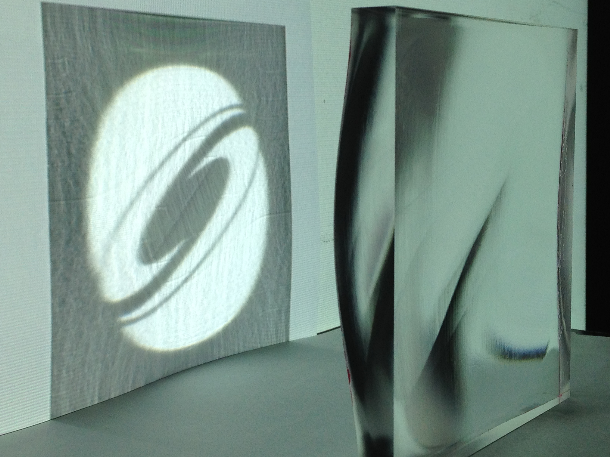
</td>
<td width="80%" height="120">
Poisson-Based Continuous Surface Generation for Goal-Based Caustics  
Y. Yue, K. Iwasaki, B.Y. Chen, Y. Dobashi, T. Nishita  
<b>ACM Transactions on Graphics (presented at SIGGRAPH 2014)</b>
</td>
</tr>
<tr>
<td width="20%">
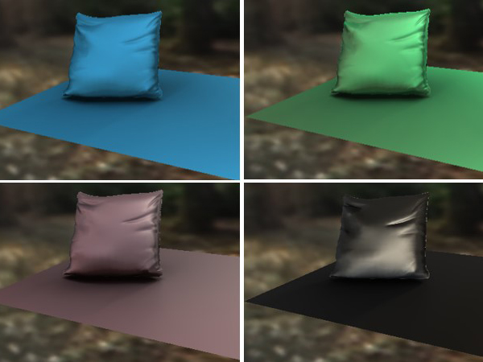
</td>
<td width="80%" height="120">
Interactive Cloth Rendering of Microcylinder Appearance Model under Environment Lighting  
K. Iwasaki, K. Mizutani, Y. Dobashi, T. Nishita  
<b>Computer Graphics Forum (Eurographics 2014)</b>
</td>
</tr>
<tr>
<td width="20%">
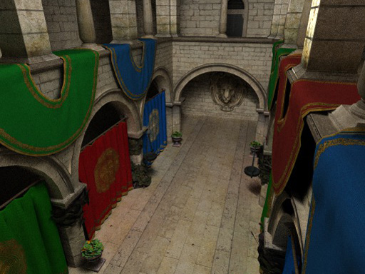
</td>
<td width="80%" height="120">
Efficient Divide-And-Conquer Ray Tracing using Ray Sampling  
K. Nabata, K. Iwasaki, Y. Dobashi, T. Nishita  
<b>High Performance Graphics 2013</b>
</td>
</tr>
<tr>
<td width="20%">
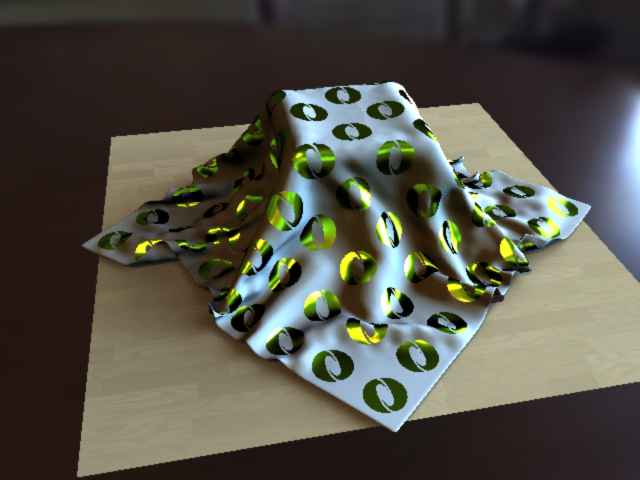
</td>
<td width="80%" height="120">
Interactive Bi-scale Editing of Highly Glossy Materials 
K. Iwasaki, Y. Dobashi, T. Nishita   
<b>ACM Transactions on Graphics (SIGGRAPH ASIA 2012)</b>
</td>
</tr>
<tr>
<td width="20%">
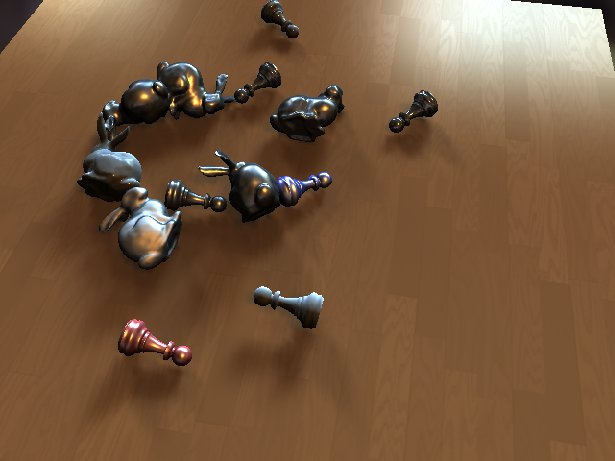
</td>
<td width="80%" height="120">
Real-time Rendering of Dynamic Scenes under All-frequency Lighting using Integral Spherical Gaussian  
K. Iwasaki, W. Furuya, Y. Dobashi, T. Nishita  
<b>Computer Graphics Forum (Eurographics 2012)</b>
</td>
</tr>
<tr>
<td width="20%">
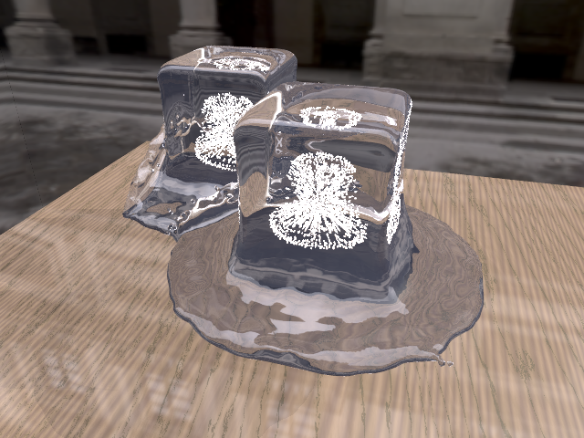
</td>
<td width="80%" height="120">
Visual Simulation of Freezing Ice with Air Bubbles  
T. Nishino, K. Iwasaki, Y. Dobashi, T. Nishita  
<b>ACM SIGGRAPH ASIA 2012 Technical Brief</b>
</td>
</tr>
<tr>
<td width="20%">
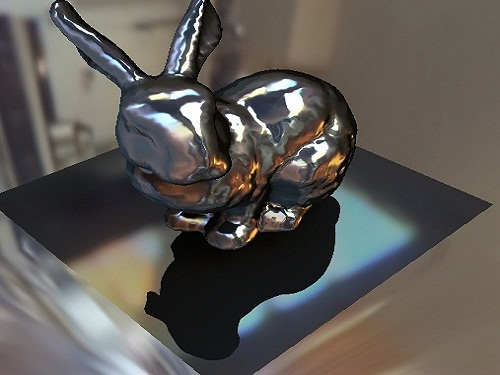
</td>
<td width="80%" height="120">
Efficient Calculation Method of Spherical Signed Distance Function for Real-time Rendering of Dynamic Scenes  
W. Furuya, K. Iwasaki, Y. Dobashi, T. Nishita  
<b>ACM SIGGRAPH ASIA 2011 Technical Sketches</b>
</td>
</tr>
<tr>
<td width="20%">
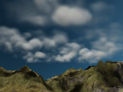
</td>
<td width="80%" height="120">
Real-time Rendering of Endless Cloud Animation  
K. Iwasaki,T. Nishino, Y. Dobashi  
<b>Pacific Graphics 2011 Short Paper </b>
</td>
</tr>
<tr>
<td width="20%">
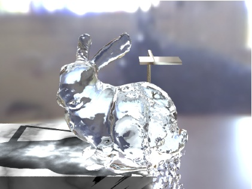
</td>
<td width="80%" height="120">
Fast Particle-based Visual Simulation of Ice Melting  
K. Iwasaki, H. Uchida, Y. Dobashi, T. Nishita  
<b>Computer Graphics Forum (Pacific Graphics 2010)</b>
</td>
</tr>
<tr>
<td width="20%">
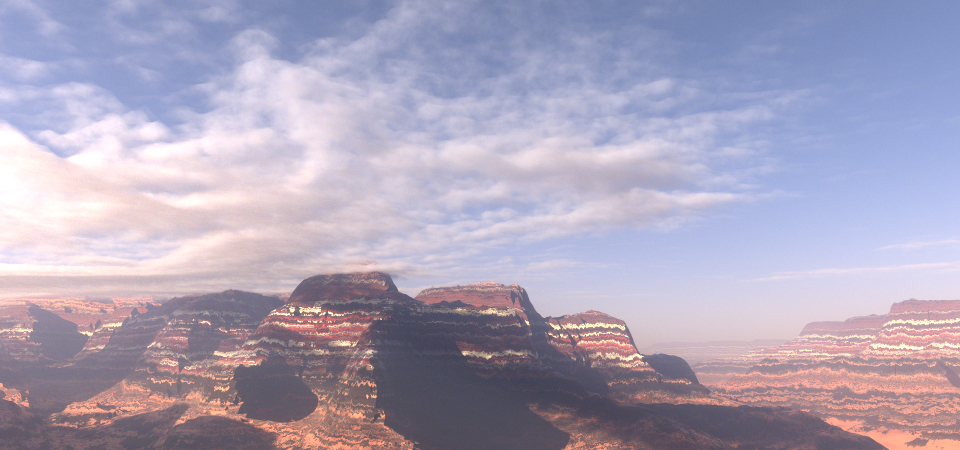
</td>
<td width="80%" height="120">
Unbiased, Adaptive Stochastic Sampling for Rendering Inhomogeneous Participating Media  
Y. Yue, K. Iwasaki, B.Y. Chen, Y. Dobashi, T. Nishita  
<b>ACM Transactions on Graphics (SIGGRAPH ASIA 2010)</b>
</td>
</tr>
<tr>
<td width="20%">
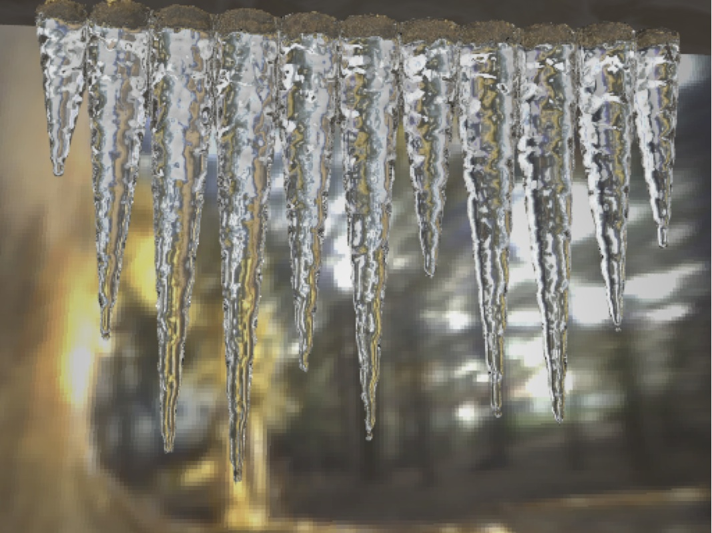
</td>
<td width="80%" height="120">
Real-Time Visual Simulation of Ice Melting, Taking Into Account Meltwater  
K. Iwasaki, H. Uchida, Y. Dobashi, T. Nishita  
<b>SIGGRAPH ASIA 2009 Sketch</b>
</td>
</tr>
<tr>
<td width="20%">
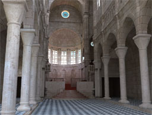
</td>
<td width="80%" height="120">
Interactive Rendering of Interior Scenes with Dynamic Environment Illumination  
Y. Yue, K. Iwasaki, B.Y. Chen, Y. Dobashi, T. Nishita  
<b>Computer Graphics Forum (Pacific Graphics 2009)</b>
</td>
</tr>

</tbody>
</table>

