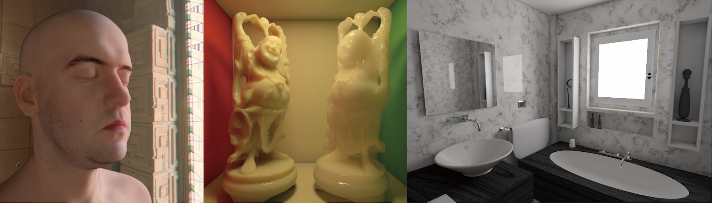

### Adaptive Irradiance Sampling for Many-Light Rendering of Subsurface Scattering




#### Abstract
Rendering a translucent material involves integrating the product of the transmittance-weighted irradiance and the BSSRDF over the surface of it. In previous methods, this spatial integral was computed by creating a dense distribution of discrete points over the surface or by importance-sampling based on the BSSRDF. Both of these approaches necessitate specifying the number of samples, which affects both the quality and the computation time for rendering. An insufficient number of samples leads to noise and artifacts in the rendered image and an excessive number results in a prohibitively long rendering time. In this article, we propose an error estimation method for translucent materials in a many-light rendering framework. Our adaptive sampling can automatically determine the number of samples so that the estimated relative error of each pixel intensity is less than a user-specified threshold. We also propose an efficient method to generate the sampling points that make large contributions to the pixel intensity taking into account the BSSRDF. This enables us to use a simple uniform sampling, instead of costly importance sampling based on the BSSRDF. The experimental results show that our method can accurately estimate the error. In addition, in comparison with the previous methods, our sampling method achieves better estimation accuracy in equal-time.

### 
```bibtex
@article{Nabata21:
    
}

```

---
